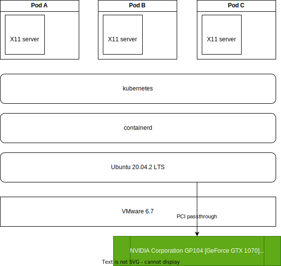
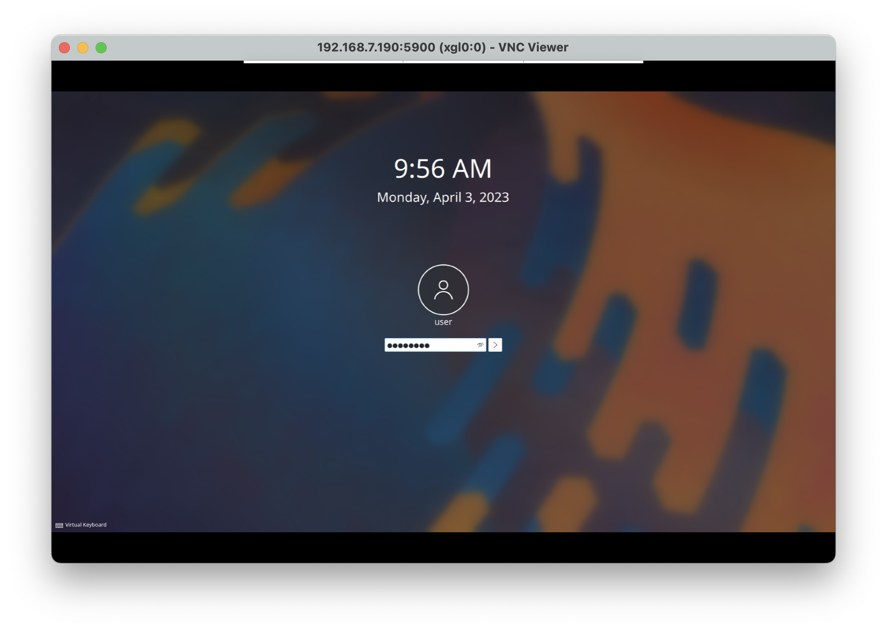
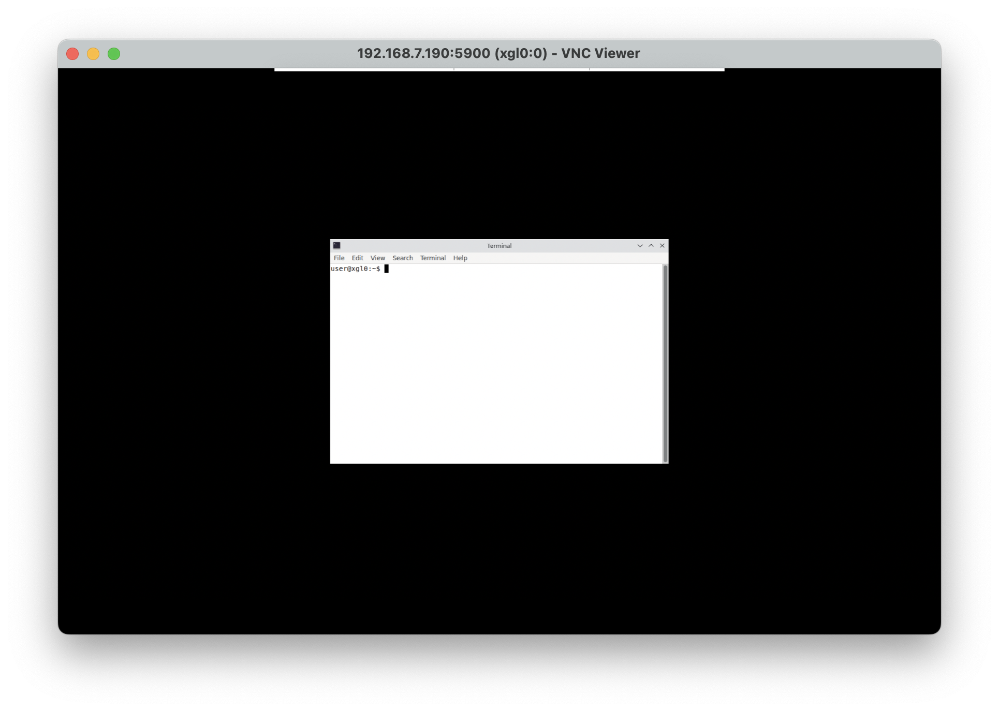
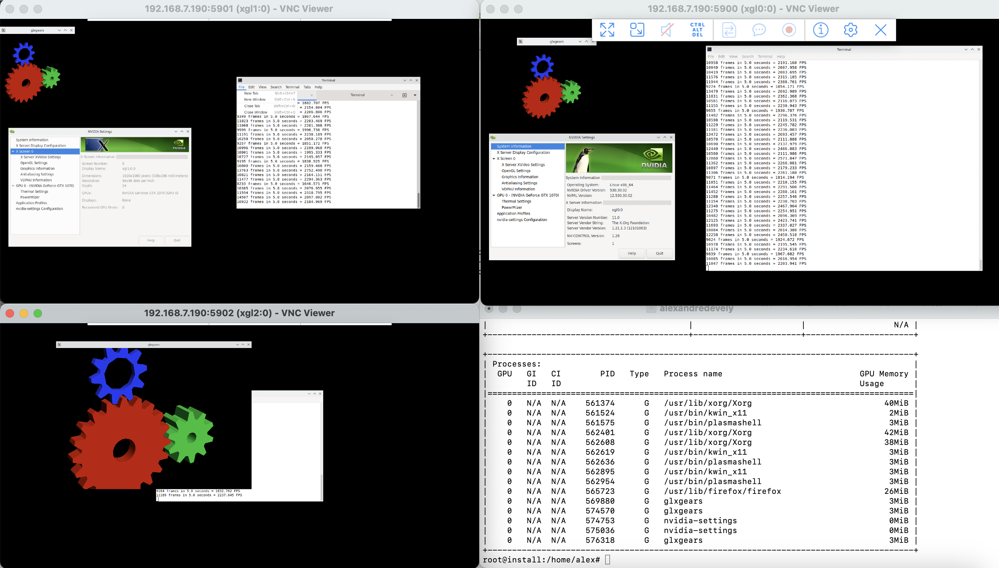

## Description

This document is a craftpad to enable and share nvidia devices in kubernetes container 

## Goal

Run application like with nvidia support inside a container 
- glxgear
- chimestrax
- others 3D applications


## Issues

- Start more than one graphical container into the host 
- Read 
https://forums.developer.nvidia.com/t/nvidia-gpu-0-failed-to-acquire-modesetting-permission/213267/4

## Install 

### Def

#### what is `headless` ?

The term `headless` refers to a configuration in which the GPU does not send display information to a display monitor

#### what is `dkms` 
Dynamic Kernel Module Support (DKMS) is a program/framework that enables generating Linux kernel modules whose sources generally reside outside the kernel source tree. The concept is to have DKMS modules automatically rebuilt when a new kernel is installed.


## Design test-1

The host is a vm Ubuntu 20.04




### Install


#### Install NVIDIA Device Plugin


##### Blacklist nouveau 

```
echo blacklist nouveau > /etc/modprobe.d/blacklist-nvidia-nouveau.conf
echo options nouveau modeset=0 >> /etc/modprobe.d/blacklist-nvidia-nouveau.conf
```

- Reboot after update-initramfs 
```
update-initramfs -u
reboot
```

##### Install  nvidia-container-toolkit-base 

Add nvidia-docker in repo

```
wget https://nvidia.github.io/nvidia-docker/gpgkey --no-check-certificate
apt-key add gpgkey
distribution=$(. /etc/os-release;echo $ID$VERSION_ID)
curl -s -L https://nvidia.github.io/nvidia-docker/$distribution/nvidia-docker.list | sudo tee /etc/apt/sources.list.d/nvidia-docker.list
sudo apt-get update && sudo apt-get install -y nvidia-container-toolkit-base
```

##### Install `cuda` package


Source https://developer.nvidia.com/cuda-downloads
Source https://docs.nvidia.com/cuda/cuda-installation-guide-linux/index.html

```
wget https://developer.download.nvidia.com/compute/cuda/repos/ubuntu2204/x86_64/cuda-keyring_1.1-1_all.deb
dpkg -i cuda-keyring_1.1-1_all.deb
apt-get update
apt-get -y install cuda
```

- run `nvidia-smi` command

```
nvidia-smi
```

```
Thu Sep 14 11:46:00 2023 
+---------------------------------------------------------------------------------------+
| NVIDIA-SMI 535.104.05             Driver Version: 535.104.05   CUDA Version: 12.2     |
|-----------------------------------------+----------------------+----------------------+
| GPU  Name                 Persistence-M | Bus-Id        Disp.A | Volatile Uncorr. ECC |
| Fan  Temp   Perf          Pwr:Usage/Cap |         Memory-Usage | GPU-Util  Compute M. |
|                                         |                      |               MIG M. |
|=========================================+======================+======================|
|   0  NVIDIA GeForce GTX 1070        Off | 00000000:03:00.0 Off |                  N/A |
| 27%   32C    P0              35W / 180W |      0MiB /  8192MiB |      1%      Default |
|                                         |                      |                  N/A |
+-----------------------------------------+----------------------+----------------------+
                                                                                         
+---------------------------------------------------------------------------------------+
| Processes:                                                                            |
|  GPU   GI   CI        PID   Type   Process name                            GPU Memory |
|        ID   ID                                                             Usage      |
|=======================================================================================|
|  No running processes found                                                           |
+---------------------------------------------------------------------------------------+
```

##### Install `containerd` and `kubernetes`

```
git clone https://github.com/jfv-opensource/kube-tools.git
cd kube-tools
./km --apply
```

#####  install runtime container

source https://docs.nvidia.com/datacenter/cloud-native/container-toolkit/latest/install-guide.html

```
curl -fsSL https://nvidia.github.io/libnvidia-container/gpgkey | sudo gpg --dearmor -o /usr/share/keyrings/nvidia-container-toolkit-keyring.gpg \
  && curl -s -L https://nvidia.github.io/libnvidia-container/stable/deb/nvidia-container-toolkit.list | \
    sed 's#deb https://#deb [signed-by=/usr/share/keyrings/nvidia-container-toolkit-keyring.gpg] https://#g' | \
    sudo tee /etc/apt/sources.list.d/nvidia-container-toolkit.list \
  && sudo apt-get update
```

install nvidia-container-toolkit 

```
apt-get install -y nvidia-container-toolkit  
```

configure nvidia runtime in containerd

```
nvidia-ctk runtime configure --runtime=containerd
INFO[0000] Loading config from /etc/containerd/config.toml 
INFO[0000] Wrote updated config to /etc/containerd/config.toml 
INFO[0000] It is recommended that containerd daemon be restarted.
```

```
sed -i 's/^#root/root/' /etc/nvidia-container-runtime/config.toml
```

restart containerd

```
systemctl restart containerd
```


#### install helm

source https://docs.nvidia.com/datacenter/cloud-native/gpu-operator/getting-started.html

```
curl -fsSL -o get_helm.sh https://raw.githubusercontent.com/helm/helm/master/scripts/get-helm-3 \
   && chmod 700 get_helm.sh \
   && ./get_helm.sh
```

add the NVIDIA Helm repository:

```
helm repo add nvidia https://helm.ngc.nvidia.com/nvidia \
   && helm repo update
```

#### install namespaces `gpu-operator` `nvidia/gpu-operator`

source https://docs.nvidia.com/datacenter/cloud-native/gpu-operator/getting-started.html

```
helm install --wait --generate-name \
     -n gpu-operator --create-namespace \
     nvidia/gpu-operator
```


##### NVIDIA package description

| Package name               | Description | 
|----------------------------|-------------|
| nvidia-driver-xxx          | The full driver package, kernel driver, 2D/3D xorg driver, cuda driver, utilities|
| nvidia-headless-xxx        | only kernel driver, cuda driver, utilities for compute servers without desktop|
| nvidia-headless-no-dkms-xxx| same as -headless but without dkms dependency so the kernel modules won’t be compiled automatically|


# Run application in host 

#### simple test on host: Start more than one Xorg server and use nvidia-smi 

Start Xorg server on DISPLAY from 0 to 4

```
Xorg :0 &
Xorg :1 &
Xorg :2 &
Xorg :3 &
Xorg :4 &
```

We should have five Xorg processes

```
nvidia-smi
```

Command result

```
Sat Apr  1 07:37:02 2023      
+---------------------------------------------------------------------------------------+
| NVIDIA-SMI 530.30.02              Driver Version: 530.30.02    CUDA Version: 12.1     |
|-----------------------------------------+----------------------+----------------------+
| GPU  Name                  Persistence-M| Bus-Id        Disp.A | Volatile Uncorr. ECC |
| Fan  Temp  Perf            Pwr:Usage/Cap|         Memory-Usage | GPU-Util  Compute M. |
|                                         |                      |               MIG M. |
|=========================================+======================+======================|
|   0  NVIDIA GeForce GTX 1070         On | 00000000:0B:00.0 Off |                  N/A |
|  0%   31C    P8                8W / 180W|     39MiB /  8192MiB |      0%      Default |
|                                         |                      |                  N/A |
+-----------------------------------------+----------------------+----------------------+
                                                                                         
+---------------------------------------------------------------------------------------+
| Processes:                                                                            |
|  GPU   GI   CI        PID   Type   Process name                            GPU Memory |
|        ID   ID                                                             Usage      |
|=======================================================================================|
|    0   N/A  N/A   1137144      G   /usr/lib/xorg/Xorg                            5MiB |
|    0   N/A  N/A   1138330      G   /usr/lib/xorg/Xorg                            5MiB |
|    0   N/A  N/A   1138664      G   /usr/lib/xorg/Xorg                            5MiB |
|    0   N/A  N/A   1138670      G   /usr/lib/xorg/Xorg                            5MiB |
|    0   N/A  N/A   1138676      G   /usr/lib/xorg/Xorg                            5MiB |
+---------------------------------------------------------------------------------------+
```

> All Xorg process are sharing the SAME PID namespace and nvidia-smi has capability to list procs.
> But NVIDIA driver is not aware of the PID namespace and nvidia-smi has no capability to map global pid to virtual pid.


#### Install kubernetes 

https://docs.nvidia.com/datacenter/cloud-native/kubernetes/install-k8s.html

- Option 2: Installing Kubernetes Using Kubeadm
- Choose containerd
- You must have the same command result at the end of the setup guide

``` bash
kubectl logs gpu-operator-test
[Vector addition of 50000 elements]
Copy input data from the host memory to the CUDA device
CUDA kernel launch with 196 blocks of 256 threads
Copy output data from the CUDA device to the host memory
Test PASSED
Done
```


#### Check the result of command `nvidia-container-cli`


```
nvidia-container-cli --load-kmods info
```

```
NVRM version:   525.105.17
CUDA version:   12.0

Device Index:   0
Device Minor:   0
Model:          NVIDIA GeForce GTX 1070
Brand:          GeForce
GPU UUID:       GPU-38ab400c-8953-69b1-5460-f70aefd40f8b
Bus Location:   00000000:0b:00.0
Architecture:   6.1
```


#### Run application in containers

##### On you kubernetes infra 

Clone the repo

```
git clone https://github.com/abcdesktopio/gpu.git
```

Create the `xgl0` sample pod

```
kubectl apply -f xgl-0.yml
deployment.apps/xgl0 created
```

Get the pod 

```
kubectl get pods 
NAME                    READY   STATUS    RESTARTS   AGE
xgl0-7d56d86f5d-kb7jn   1/1     Running   0          7s
```


Forward local TCP port 5900 to container TCP port 5900

```
kubectl port-forward xgl0-7d56d86f5d-kb7jn --address 0.0.0.0 5900:5900 &
Forwarding from 0.0.0.0:5900 -> 5900
```

Start xterm application inside the `xgl0` pod

```
kubectl exec -it xgl0-7d56d86f5d-kb7jn -- bash
user@xgl0:~$ nohup gnome-terminal &
[1] 467
user@xgl0:~$ nohup: ignoring input and appending output to 'nohup.out'
user@xgl0:~$ 
```

On the node with the nvidia gpu, run nvidia-smi command, to check that the processes `/usr/lib/xorg/Xorg` `/usr/bin/kwin_x11` `/usr/bin/plasmashell` are running. 

```
# nvidia-smi 
Mon Apr  3 09:59:09 2023       
+---------------------------------------------------------------------------------------+
| NVIDIA-SMI 530.30.02              Driver Version: 530.30.02    CUDA Version: 12.1     |
|-----------------------------------------+----------------------+----------------------+
| GPU  Name                  Persistence-M| Bus-Id        Disp.A | Volatile Uncorr. ECC |
| Fan  Temp  Perf            Pwr:Usage/Cap|         Memory-Usage | GPU-Util  Compute M. |
|                                         |                      |               MIG M. |
|=========================================+======================+======================|
|   0  NVIDIA GeForce GTX 1070         On | 00000000:0B:00.0 Off |                  N/A |
|  0%   36C    P8                9W / 180W|     38MiB /  8192MiB |     17%      Default |
|                                         |                      |                  N/A |
+-----------------------------------------+----------------------+----------------------+
                                                                                         
+---------------------------------------------------------------------------------------+
| Processes:                                                                            |
|  GPU   GI   CI        PID   Type   Process name                            GPU Memory |
|        ID   ID                                                             Usage      |
|=======================================================================================|
|    0   N/A  N/A    951316      G   /usr/lib/xorg/Xorg                           28MiB |
|    0   N/A  N/A    951454      G   /usr/bin/kwin_x11                             3MiB |
|    0   N/A  N/A    951520      G   /usr/bin/plasmashell                          3MiB |
+---------------------------------------------------------------------------------------+
```


##### On the user desktop

Using VNC client, connect to the host running the `kubectl port-forward`.

The default passwd is `mypasswd` for VNC and for the user.

VNC Login 



User Login 




#### Repeat the same process for `xgl1` and `xgl2` 


```
# nvidia-smi 
Sun Apr  2 17:21:47 2023       
+---------------------------------------------------------------------------------------+
| NVIDIA-SMI 530.30.02              Driver Version: 530.30.02    CUDA Version: 12.1     |
|-----------------------------------------+----------------------+----------------------+
| GPU  Name                  Persistence-M| Bus-Id        Disp.A | Volatile Uncorr. ECC |
| Fan  Temp  Perf            Pwr:Usage/Cap|         Memory-Usage | GPU-Util  Compute M. |
|                                         |                      |               MIG M. |
|=========================================+======================+======================|
|   0  NVIDIA GeForce GTX 1070         On | 00000000:0B:00.0 Off |                  N/A |
| 20%   50C    P0               55W / 180W|    182MiB /  8192MiB |     85%      Default |
|                                         |                      |                  N/A |
+-----------------------------------------+----------------------+----------------------+
                                                                                         
+---------------------------------------------------------------------------------------+
| Processes:                                                                            |
|  GPU   GI   CI        PID   Type   Process name                            GPU Memory |
|        ID   ID                                                             Usage      |
|=======================================================================================|
|    0   N/A  N/A    561374      G   /usr/lib/xorg/Xorg                           40MiB |
|    0   N/A  N/A    561524      G   /usr/bin/kwin_x11                             2MiB |
|    0   N/A  N/A    561575      G   /usr/bin/plasmashell                          3MiB |
|    0   N/A  N/A    562401      G   /usr/lib/xorg/Xorg                           42MiB |
|    0   N/A  N/A    562608      G   /usr/lib/xorg/Xorg                           38MiB |
|    0   N/A  N/A    562619      G   /usr/bin/kwin_x11                             3MiB |
|    0   N/A  N/A    562636      G   /usr/bin/plasmashell                          3MiB |
|    0   N/A  N/A    562895      G   /usr/bin/kwin_x11                             3MiB |
|    0   N/A  N/A    562954      G   /usr/bin/plasmashell                          3MiB |
|    0   N/A  N/A    565723      G   /usr/lib/firefox/firefox                     26MiB |
|    0   N/A  N/A    569880      G   glxgears                                      3MiB |
|    0   N/A  N/A    574570      G   glxgears                                      3MiB |
|    0   N/A  N/A    574753      G   nvidia-settings                               0MiB |
|    0   N/A  N/A    575036      G   nvidia-settings                               0MiB |
|    0   N/A  N/A    576318      G   glxgears                                      3MiB |
+---------------------------------------------------------------------------------------+
```

Screenshot running 3 vncviewer and the nvidia-smi command result  


